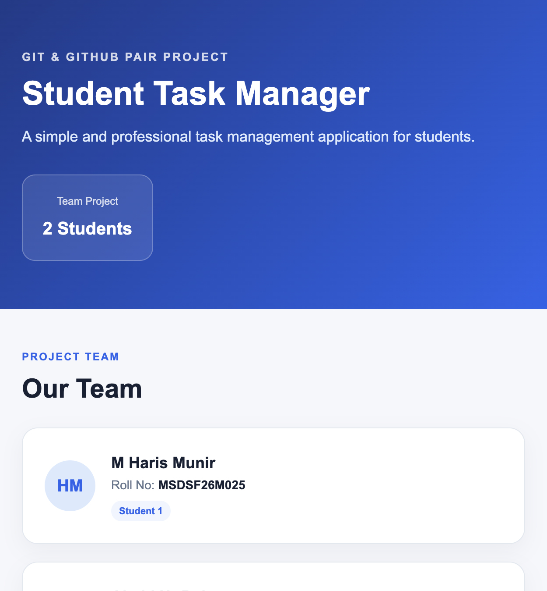
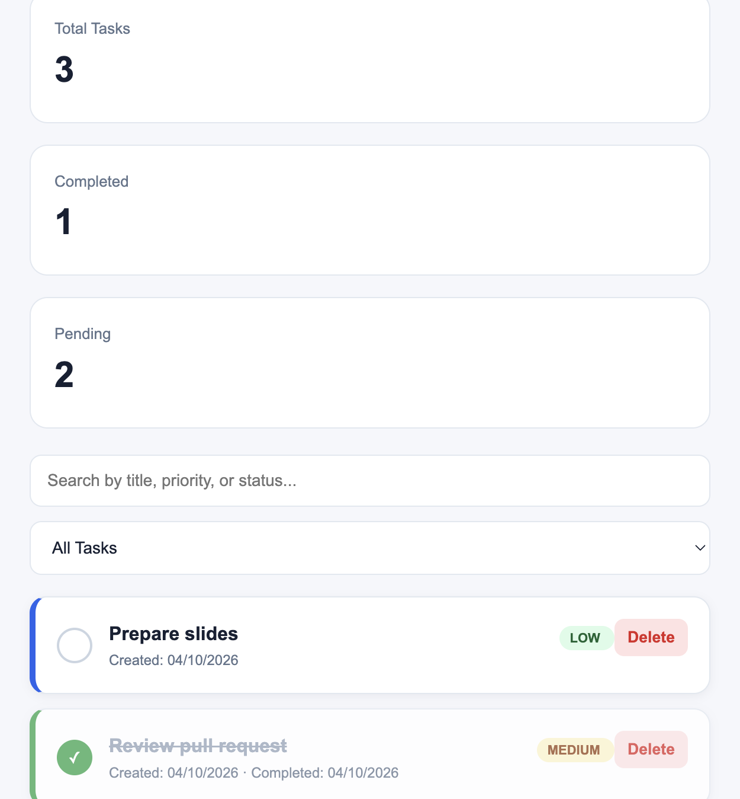
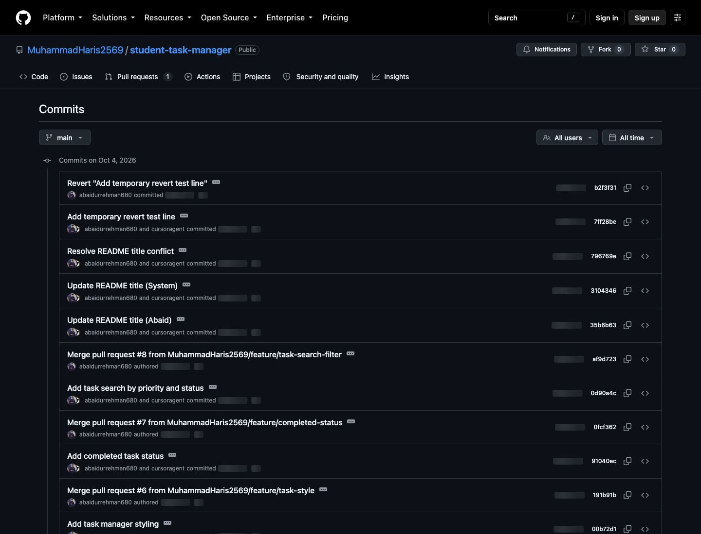

# Student Task Management System

A small web application that lets a student add tasks, mark them complete, delete them, and search the list. The project was built by a pair so both students could practice a real Git and GitHub workflow: branches, issues, pull requests, review, a merge conflict, and a tagged release.

## Project Description

Student Task Manager runs in the browser. Tasks stay in the browser's local storage, so the page does not need a server. The page shows the two teammates, a form for a new task and its priority, totals for all, completed, and pending tasks, and a search box.

## Team Members

| Role | Name | Roll number | GitHub |
| --- | --- | --- | --- |
| Student 1 | M Haris Munir | MSDSF26M025 | [MuhammadHaris2569](https://github.com/MuhammadHaris2569) |
| Student 2 | Abaid ur Rehman | MSDSF26M011 | [abaidurrehman680](https://github.com/abaidurrehman680) |

Repository: https://github.com/MuhammadHaris2569/student-task-manager

## Features

- Add a task with a title and a priority (low, medium, or high)
- Show the task list with created dates
- Mark a task complete and store the completion date
- Delete a task after confirmation
- Search by title, priority, or status words such as completed and pending
- Filter the list to all, pending, or completed tasks
- Responsive layout, including stacked task cards on a narrow screen

## Technologies

- HTML
- CSS
- JavaScript
- Git
- GitHub

## Git Workflow

1. Student 1 created the repository, the first files, and the first commits on `main`.
2. Each feature was developed on its own branch.
3. The branch was pushed and opened as a pull request into `main`.
4. The other student reviewed Student 1's pull request. Linked issues used `Closes #<number>` so GitHub could close them when the matching pull request reached the default branch.
5. Both students changed the same README line on different branches. The merge conflict was resolved by hand, then the result was pushed to `main`.
6. Recovery commands (`stash`, `restore`, `reset --soft`, and `revert`) were demonstrated on `main`.
7. The repository was tagged `v1.0.0` and published as a GitHub Release.

## Branches

| Branch | Purpose |
| --- | --- |
| `main` | Stable shared history |
| `feature/task-form` | Student 1's first form work. This is also the repository's default branch on GitHub |
| `feature/task-search` | Student 1's earlier search commit |
| `feature/task-style` | Student 2's card styling and mobile layout |
| `feature/completed-status` | Student 2's completion date |
| `feature/task-search-filter` | Student 2's search by priority and status |
| `docs/readme-abaid` | README title "Student Task Management Application" |
| `docs/readme-system` | README title "Student Task Management System" |
| `docs/readme-haris` | Student 1's earlier website update |
| `docs/final-readme` | This documentation update |

## Git Commands Demonstrated

`git init`, `git status`, `git add`, `git commit`, `git log`, `git log --oneline --graph`, `git branch`, `git switch`, `git diff`, `git diff --staged`, `git clone`, `git remote -v`, `git push`, `git fetch`, `git pull`, `git merge`, `git stash`, `git stash pop`, `git restore`, `git reset --soft`, `git revert`, `git show`, `git blame`, `git tag`, and `git push --tags`.

## GitHub Features Demonstrated

- Public repository and collaborator access
- Branches
- Issues with a description, expected behavior, and acceptance criteria
- Pull requests, including `Closes #<issue>`
- A line of review conversation and an approval
- Merges
- A resolved merge conflict
- Tag `v1.0.0` and a GitHub Release
- Contribution history for both students

## How to Run

1. Clone the repository.
2. Open the project folder.
3. Open `index.html` in a modern browser.
4. Add a task, mark it complete, delete one, and try the search box.

No install step is required.

## Screenshots

## Version History

| Version | Notes |
| --- | --- |
| v1.0.0 | Add, complete, delete, and search tasks. Includes styling, a responsive layout, pair documentation, and the Git workflow used for this assignment. |

## Contributors

- M Haris Munir (MuhammadHaris2569) — project setup, task form, first search behavior, and the first README
- Abaid ur Rehman (abaidurrehman680) — styling, completed-task date, search by priority and status, issues, pull requests, review of pull request #1, the README conflict resolution, and this documentation
